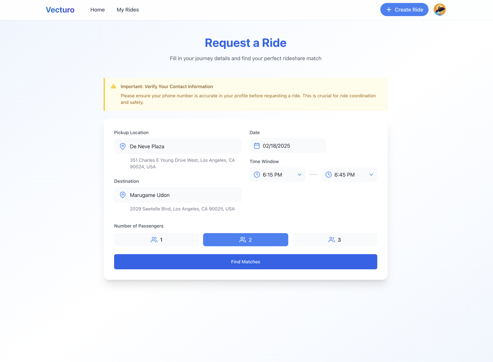
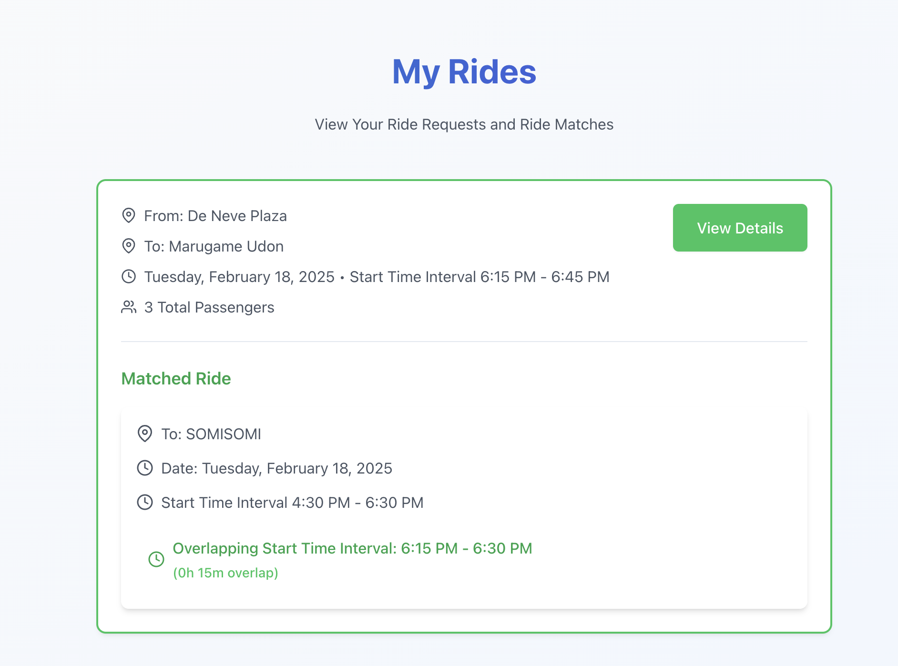
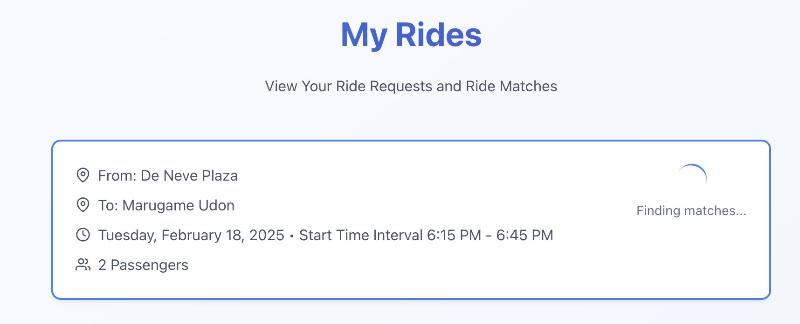
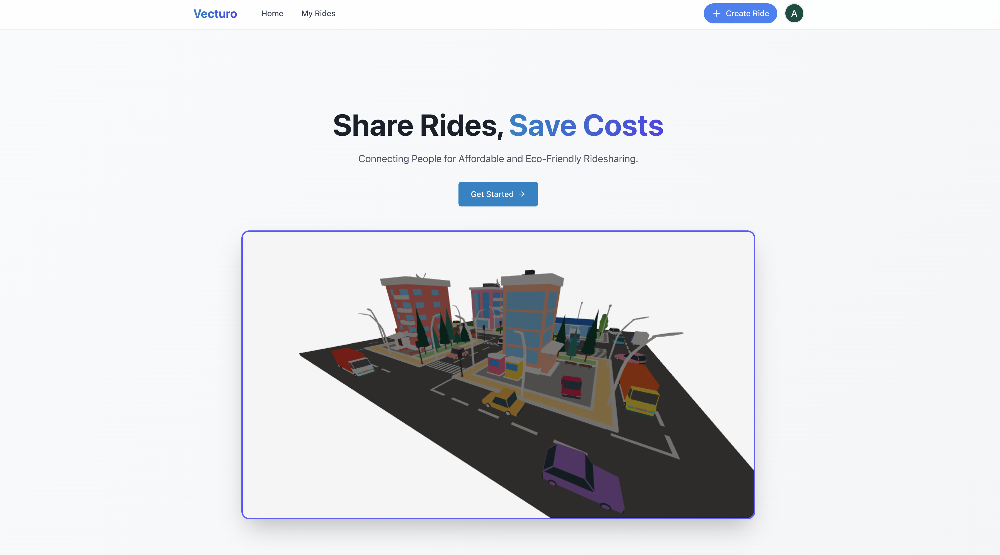

# Vecturo
Vecturo is a rideshare utility that matches two users travelling to similar destinations leading to drastic savings in ridesharing costs.
## Usage
### Signing In
- You must log in with Google
- Enter phone number on sign up
### Creating a Ride
- Either click "Get Started" on the home page or "Create Ride" in the top right
- Enter pickup location, desination, relevant time and date details, and number of passengers
- Click "Find Matches"
- Vecturo will now look for potential matches for your rideshare
### Booking and Travel
- You will be notified if a match for your ride has been found through the "My Rides" page in the navigation bar at the top of the page
- If your ride has been matched click you will see some prelimiarly information. For further instructions click "View Details"
- The details page will provide in depth travel directions, visuals, and instructions so you and your matched rideshare partner can efficiently book and travel to your destinations
- Enjoy your savings
## Gallery
<div style="display: flex; gap: 10px; align-items: center;">
  <div style="text-align: center;">
    <div>Person A sees</div>
    <video src="./media/persona.mp4" style="max-width: 100%; height: auto;">
  </div>
  <div style="text-align: center;">
    <div>Person B sees</div>
    <video src="./media/personb.mp4" style="max-width: 100%; height: auto;">
  </div>
</div>





## Installation and Running
First clone Vecturo's repository to your local machine and enter the directory
```shell
https://github.com/aroy23/Vecturo.git
cd Vecturo
```
Next, set up environment variables
```shell
cd client
touch .env

Inside this .env file you must add:

# Backend URL
VITE_API_URL 
# Firebase Environment Variables
VITE_FIREBASE_API_KEY=...
VITE_FIREBASE_APP_ID=...
VITE_FIREBASE_AUTH_DOMAIN=...
VITE_FIREBASE_MEASUREMENT_ID=...
VITE_FIREBASE_MESSAGING_SENDER_ID=...
VITE_FIREBASE_PROJECT_ID=...
VITE_FIREBASE_STORAGE_BUCKET=...
VITE_GOOGLE_MAPS_API_KEY=...

cd ../server
touch .env

Inside this .env file you must add:

# Firebase
FIREBASE_SERVICE_ACCOUNT=...
# Google Maps API Key
GOOGLE_MAPS_API_KEY=...
# URI for MongoDB Database
MONGODB_URI=...
# Port for Backend
PORT=...
```

Now you are ready to start the application

```shell
npm run install-all && npm start
```

Navigate to the link shown in the terminal.
## Notes
If you have any questions you can contact me at arnavroy[at]ucla[dot]edu